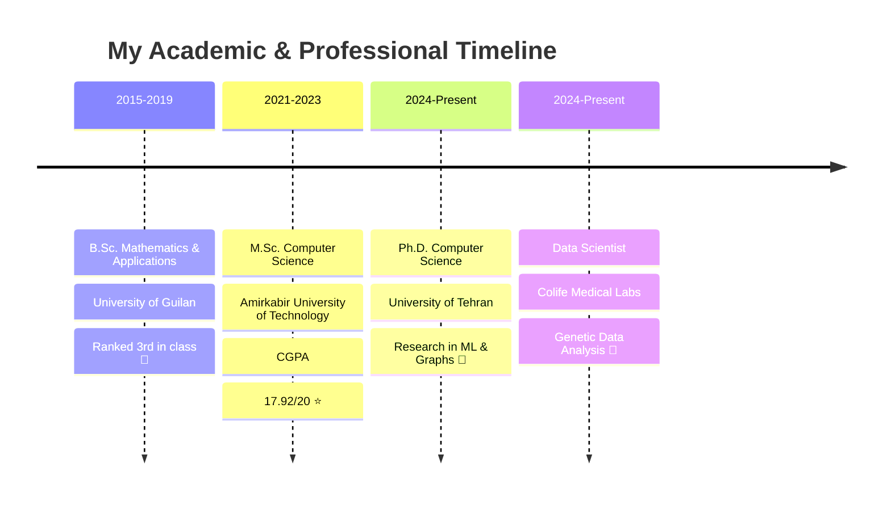

<div align="center">
  
# Hi there! 👋 I'm Dariush


</div>

---

## 🌟 About Me

```python
class DariushKazemi:
    def __init__(self):
        self.name = "Dariush Kazemi"
        self.location = "Tehran, Iran 🇮🇷"
        self.current_role = ["Data Scientist", "Ph.D. Student", "ML Researcher"]
        self.education = {
            "current": "Ph.D. Computer Science @ University of Tehran",
            "completed": "M.Sc. Computer Science @ Amirkabir University"
        }
        self.interests = [
            "Machine Learning 🤖", 
            "Graph Neural Networks 🕸️",
            "Genetic Data Analysis 🧬",
            "Geospatial Analytics 🗺️"
        ]
        self.fun_fact = "I type at 105+ WPM! ⚡"
    
    def say_hi(self):
        print("Thanks for dropping by! Let's build something amazing together! 🚀")

me = DariushKazemi()
me.say_hi()
```

---

<div align="center">

## 🚀 What I'm Up To

🔬 **Currently Working On:** Geoinformatics research with PostgreSQL + PostGIS databases  
🧬 **Research Focus:** Machine Learning with Graphs and Genetic Data Analysis  
🎯 **Learning:** Advanced LLM Fine-tuning and Federated Learning  
💡 **Open to:** Collaboration on ML projects and research opportunities  

</div>

---

## 🛠️ My Tech Stack

<div align="center">

### Languages & Frameworks


### AI/ML & Data Science


### Databases & Cloud


### Web Development


</div>

---

## 📊 GitHub Analytics

<div align="center">
  


</div>

<div align="center">
  


</div>

---

## 🏆 My Superpowers

<div align="center">

### ⚡ Lightning Fast Typing


**105+ WPM** - Because code doesn't write itself! 🚀

</div>

<div align="center">

### 🎯 Problem Solving Skills
```
[████████████████████████████████] 100% - Debugging & Algorithm Design
[██████████████████████████████  ] 95%  - System Architecture  
[████████████████████████████    ] 90%  - Data Analysis & ML
[██████████████████████████      ] 85%  - Research & Innovation
```

</div>

---

## 🌟 Highlighted Projects

<div align="center">

<table>
<tr>
<td width="50%">

### 💊 Drug-Drug Interaction System


🔬 **Advanced ML system** using Graph Neural Networks  
🤖 **Fine-tuned Llama3.2** for medical recommendations  
⚛️ **Modern React interface** with real-time analysis  

</td>
<td width="50%">

### 🧬 Genetic Database Platform


🏥 **Personalized medicine** expert advisor  
📊 **Whole-exome genetic data** processing  
🔍 **Advanced analytics** for disease research  

</td>
</tr>
<tr>
<td width="50%">

### 🗺️ Geospatial Analytics


🌍 **Hotspot analysis** with spatial databases  
🤖 **LLM integration** for pattern recognition  
📈 **Real-time geospatial** data processing  

</td>
<td width="50%">

### 🎮 Federated Learning Research


📡 **Spectrum sharing** optimization  
🤝 **Multi-agent simulations** & federated learning  
📊 **Performance analysis** of FDQN vs FDPG  

</td>
</tr>
</table>

</div>

---

## 🎓 Academic Journey

<div align="center">



</div>

---

## 🏅 Achievements & Fun Facts

<div align="center">

🎓 **National Full Scholarships** for both M.Sc. & B.Sc.  
🥇 **Gold Medal** in International Scientific League of PAYA  
🌟 **NODET Graduate** (National Organization for Development of Exceptional Talents)  
📜 **CCNA & CCENT Certified** Network Professional  
⚡ **105+ WPM** Typing Speed Champion  
🎯 **Teaching Assistant** for 3+ years in ML & Algorithms  

</div>

---

## 🌈 Fun Zone

<div align="center">

### 🎵 Coding Playlist Mood


### 🔥 Current Vibe


**Status:** *Debugging code while sipping coffee ☕ and listening to lo-fi beats 🎶*

</div>

---

## 📫 Let's Connect & Collaborate!

<div align="center">

[](mailto:dariushkazemi77@gmail.com)
[](https://github.com/Zalius)
[](https://linkedin.com/in/dariush-kazemi)

### 💬 Open to:
- 🤝 **Collaboration** on ML/AI projects
- 📚 **Research partnerships** in Graph Neural Networks  
- 💼 **Freelance opportunities** in Data Science
- 🎓 **Academic discussions** and knowledge sharing

</div>

---

<div align="center">

### 🎯 Life Philosophy

*"Code is poetry written in logic, data tells stories waiting to be discovered, and every algorithm is a step towards solving tomorrow's challenges."*

---


[](https://github.com/Zalius)

**Thanks for stopping by! Let's build the future together! 🚀✨**

 <em><b>Happy coding!</b> And remember, every expert was once a beginner!</em> 

</div>
